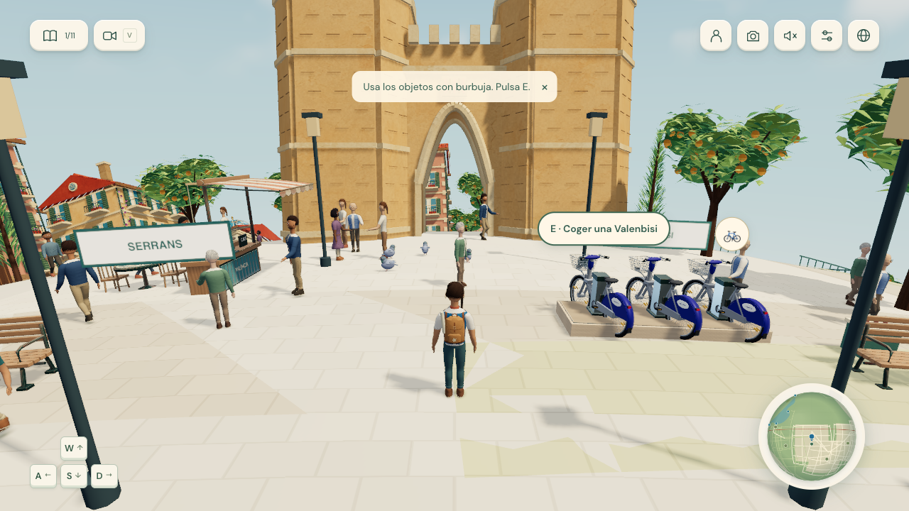

# La Terreta



Explore Valencia on a small Mediterranean planet. Walk through the old city,
ride a Valenbisi, board the tram, or row across Albufera. Find 11 places, meet
residents, and complete eight local activities at your own pace.

Built with TypeScript, Three.js, Vite, and original Blender models. The game
runs in the browser. Models, textures, fonts, and sound ship with the project.
No backend or secret API key is required. Optional PostHog analytics uses a
public project token.

## Run locally

Use Node.js 24, npm, and a browser with WebGL 2.

```sh
nvm use
npm ci
npm run dev
```

Open [the local game](http://127.0.0.1:5173/). If you do not use NVM, install
Node.js 24 and omit `nvm use`.

```sh
npm run build
npm run preview
```

The production preview runs at [localhost:4173](http://127.0.0.1:4173/).

## Explore

The world is a complete sphere with paths across both poles and around the
equator. The old city, science campus, coast, lagoon, rice fields, orange groves,
and wooded paths connect through walking routes and a six-stop tram line.
The layout is an artistic interpretation of Valencia.

The travel book records Torres dels Serrans, Ciutat Vella, Plaça de l’Ajuntament,
Estació del Nord, Plaça de Bous, Ciutat de les Arts i les Ciències, Aqua
Multiespacio, El Saler · La Devesa, Universitat de València, L’Albufera, and
Jardí del Túria.

Choose **DONA** or **HOME** to start. Use **Change your look** to edit your
explorer. English, Spanish, and Valencian are available in the language controls.

| Control | Action |
| --- | --- |
| WASD / arrow keys | Move; steer when using transport |
| Shift | Run |
| Mouse drag | Turn the camera |
| V / F | Change view / use first-person view |
| Scroll | Change camera distance |
| E | Use the shown action or leave an activity |
| B | Borrow or park a bike |
| S / Down on a bike | Brake, then reverse while held |
| H | Ring the bike bell |
| M / J | Open the map / travel book |
| P | Open selfie mode |
| R | Return to Serrans |
| Esc | Pause, close a panel, or release the mouse |

On touch screens, use the left joystick to move and drag the world with another
finger to look. Push the joystick to its edge to run. Pinch to change camera
distance. Use the action buttons to interact, leave transport, or ring the bell.
In selfie mode, use the camera pad to move the view.

Borrow a bike at a dock and park it for later use. At a tram stop, use E to board.
While the tram moves, E requests an exit at the next stop. At an Albufera dock,
use E to board a boat. Row with W, steer with A/D, and slow with S. Leave at a dock.

## Things to do

| Activity | Goal |
| --- | --- |
| Pick oranges | Pick three different oranges |
| Drink horchata | Enjoy a drink at the Serranos café for eight seconds |
| Throw a firecracker | Throw one and watch it pop |
| Row in Albufera | Travel 20 metres across one or more trips |
| March with the band | Join the band for 10 seconds |
| Ride a Valenbisi | Travel one kilometre in total |
| Pet the bull | Stroke its head for three seconds |
| Selfie with the Falla | Save a photo with the explorer and monument in view |

The book has separate pages for places and activities. **Show the way** tracks
one activity. Optional moments include a resident's photo request, a waterside
bench, and hidden places. Afternoon changes to evening during active play.
Residents, birds, cats, street carts, children, and the Fallas band bring movement
to the city.

Progress and appearance are saved in this browser. Old saves keep their places,
memories, and badges. Clearing browser storage removes local progress. Saves do
not sync between devices or between different site addresses.

## Sound and graphics

Sound starts off. Turn it on to hear city and forest music, local sounds, and
the moving Fallas band. The band becomes clearer as you approach and the
background music fades down. Mute, pause, photo mode, globe view, and a hidden
browser tab control the sound mix.

Light, Balanced, and High settings change render cost. Distant models use less
geometry. The build compresses models without reducing their detail. Colour
images use a small quality reduction to reduce download size.
Sound effects use lossless FLAC. Music keeps its original MP3 encoding.

## Game analytics

PostHog collects events on the production domains only. Set `VITE_POSTHOG_TOKEN`
and `VITE_POSTHOG_HOST` in the Vercel production environment before building.
Use the public project token, never a personal or secret API key. `.env.example`
lists the settings. A local `.env.local` file is ignored by Git.

The SDK ships with the game. Automatic click capture, session recording, surveys,
and person profiles are off. A random browser ID uses local storage to estimate
unique and returning players. Browser storage resets and different devices can
count the same person again. Do Not Track is respected. Collection failures do
not stop play or change saved progress.

| Event | Meaning |
| --- | --- |
| `game_started` | Play started once on this page, with a new `game_session_id` |
| `game_play_time` | `active_seconds` since the last report; sum these for play time |
| `place_discovered` | A new place ID was added to the travel book |
| `activity_started` | An activity began, including a bike or boat trip |
| `activity_completed` | A task reached its target for the first time in this save |
| `transport_changed` | Travel mode changed: walk, bike, tram, or boat |
| `memory_discovered` | A new memory was saved |
| `photo_taken` | A photo was made; no image is sent |
| `all_places_discovered` | All 11 places were found |

The timer stops while paused or hidden, and after 60 seconds without input.
Held movement keys and touch controls count as input. Reports are sent each
60 seconds and when play stops or transport changes. Closing a browser can lose
the final report. `session_active_seconds` is cumulative; do not sum it.
Old discoveries and completed tasks are not sent again when a save loads.

Filter dashboards to `environment = production`. Local analytics is off unless
started with `VITE_POSTHOG_TEST_MODE=true npm run dev`; these events have
`environment = test`. Preview deployments do not collect events.

## Check the project

```sh
npm run build
npm run check
```

The full check command also needs Python 3. Run individual checks for a small change:

| Command | Purpose |
| --- | --- |
| `npm run check:movement` | Movement, camera, bike, and saved-data rules |
| `npm run check:wetland` | Boat hull clearance, docks, and wetland travel |
| `npm run check:immersion` | Activities, routes, reactions, and day state |
| `npm run check:assets` | Shipped props, character motion, and contact points |
| `npm run check:characters` | GLB skins, weights, morphs, and animation clips |
| `npm run check:compression` | Compare built assets with source data; run after `npm run build` |

These checks do not replace browser checks for controls, sound, or visual changes.

## Asset compression and browser cache

`npm run build` runs the asset tools in `scripts/compression/`. It writes the
smallest tested image format, shares repeated model textures, removes
duplicate model data, and applies Meshopt where it also reduces Brotli transfer
size. Every model value and normal-map pixel must match after decoding. The tools
keep geometry precision, triangle order, animation keys, skins, morphs, image
dimensions, and transparency. Colour images can use WebP quality 82, with a
colour-error check and exact alpha. Normal maps and other data textures stay
lossless. The tools do not simplify meshes, quantize geometry, or resample audio.

Models in `public/` keep the standard GLB format for the Blender tools and source
checks. The production GLBs in `dist/media/` use the bundled Three.js Meshopt
decoder. PNG source files stay available to the art builders. Production images
use WebP when it is smaller and passes the image checks. The share image keeps
PNG format. Source colour PNGs use a smaller palette; JPEG photos use quality 82.
Image dimensions and metadata stay available.

The build also minifies JavaScript and CSS. Fonts use local WOFF2 files, with the
existing WOFF fallback. Vercel supplies HTTP Brotli or gzip compression. No extra
JavaScript decompressor, external decoder download, or server function is needed
for HTTP compression. The local preview tests asset formats and cache headers;
it does not reproduce Vercel's HTTP compression.

Files in `dist/media/` and `dist/assets/` have content hashes in their names.
`vercel.json` gives them `Cache-Control: public, max-age=31536000, immutable`.
Browsers can reuse them for one year. A changed file gets a new URL. HTML, the
share image, and other files with stable URLs use browser cache revalidation so
updates remain visible. Saved game data uses the same storage keys as before.

Build measurements are written to ignored `output/compression/build-report.json`.
Run `npm run check:compression` to compare all built model buffers, texture
quality, asset hashes, and cache rules with the source files. Check the production
preview in a browser after changes to the asset tools.

## Source and asset tools

| Path | Contents |
| --- | --- |
| `src/` | Game systems, controls, interface, and translations |
| `public/` | Assets served by the game and third-party notices |
| `assets/` | Editable Blender source files |
| `scripts/` | Asset builders, shared model helpers, and focused checks |
| `PROMPT.md` | Ordered prompts to build the complete game |
| `AGENTS.md` | Project instructions for Codex |

The shipped assets are ready to use. Blender is needed only to change the art.
Builders use the Blender 5.2 Python API. Run them from the project root:

```sh
blender --background --python scripts/build_activity_assets.py
blender --background --python scripts/build_garden_life.py -- --skip-renders
```

Build only the asset family you change. The main entry points are:

| Asset family | Builder |
| --- | --- |
| Landmarks | `build_models.py` |
| Village and plants | `build_village.py` |
| Painted landmark/village materials | `apply_materials.py` |
| Distant village models | `build_lod.py` |
| Animated characters | `build_animated_characters.py` |
| Small city props | `build_craft.py` |
| Civic plaza and Fallas art | `build_civic_plaza.py`, `build_festival_craft.py`, `build_astra_falla.py` |
| Bike | `build_valenbisi.py` |
| Wetland and birds | `build_wetland.py`, `build_wetland_birds.py` |
| Garden animals and flowers | `build_garden_life.py` |
| Tram, bull, and water texture | `build_scene_improvements.py` |
| Local activity props | `build_activity_assets.py` |

After rebuilding landmarks or the village, run `apply_materials.py`. Use
`-- --landmarks-only` when only landmarks changed. Run `build_lod.py` after a
village change. Character and craft helper modules support their builders;
they are not separate commands. Optional render and export reports go to
ignored `output/art/`.

`generate_music.py` and `generate_elevenlabs_sounds.py` generate missing audio
through ElevenLabs. They need Python 3, FFmpeg, a paid API account, and a key in
the ignored `.elevenlabs.txt` file. Existing output files are kept. Generation
is separate from the app build. Never upload the key. Audio prompts and metadata
are stored beside the shipped audio in `public/audio/`.

## Deploy to Vercel

The project includes `vercel.json` for a static Vite build:

| Setting | Value |
| --- | --- |
| Project name | `la-terreta` |
| Root directory | Repository root |
| Framework | Vite |
| Node.js | 24.x |
| Install command | `npm ci` |
| Build command | `npm run build` |
| Output directory | `dist` |
| Environment variables | None required |

Push the repository to GitHub, import it into Vercel, and use these settings.
For a CLI deployment, run the following from this directory:

```sh
npx vercel login
npx vercel link
npx vercel deploy
```

Select or create `la-terreta` in your intended Vercel account during linking.
Check the preview before publishing production with `npx vercel deploy --prod`.
`.vercelignore` excludes Blender sources, scripts, local keys, and temporary files
from CLI uploads. Shipped assets in `public/` remain part of the deployment.
See [Vercel's Vite guide](https://vercel.com/docs/frameworks/frontend/vite).

## Search and link previews

The site includes a search description, canonical URL, Open Graph and Twitter
preview tags, a gameplay image, WebSite and VideoGame structured data, robots.txt,
and a sitemap. The canonical address is https://la-terreta-nu.vercel.app/. If
you change the production domain, update index.html, public/robots.txt, and
public/sitemap.xml together. The page title and description follow the selected
language. Search engines choose when and how to display search results.

## Analytics

Vercel Web Analytics is loaded in production builds. Local development does not
load the tracking script. Enable **Web Analytics** in the Vercel project dashboard
and deploy the updated code to collect page views. No API key is required.
See the [Vercel Analytics setup guide](https://vercel.com/docs/analytics/quickstart).

## License

[MIT](LICENSE), copyright 2026 rolottr. Third-party dependencies, fonts, and
media retain their own licenses and terms. Keep the notices in `public/licenses/`
and the source information supplied with media files.
